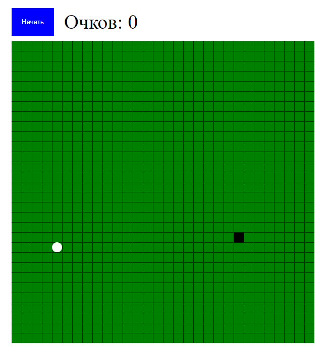
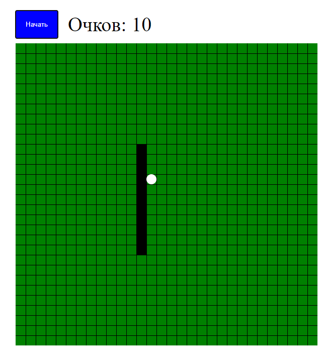

# Игра "Змейка"

Добро пожаловать в игру "Змейка"! Эта классическая аркадная игра разработана с использованием HTML, CSS и JavaScript. В ней вы управляете змейкой, которая должна есть еду, расти и избегать столкновений со стенами и своим собственным телом.

## Содержание

- [Особенности](#особенности)
- [Как начать](#как-начать)
- [Как играть](#как-играть)

## Особенности

- **Классический геймплей**: Управляйте змейкой, чтобы она ела еду и росла.
- **Простое управление**: Используйте клавиши со стрелками для навигации змейкой.
- **Отслеживание очков**: Система учета очков.

## Как начать

Чтобы запустить игру "Змейка" на вашем компьютере, выполните следующие шаги:

1. Клонируйте репозиторий:

   ```bash
   git clone https://github.com/Raven-91/snakegame.git

2. Перейдите в директорию проекта:

   ```bash
   cd snakegame

3. Откройте файл index.html в вашем веб-браузере.

## Как играть

1. Запустите игру: Откройте index.html в вашем браузере.
2. Управляйте змейкой: Используйте клавиши со стрелками (вверх, вниз, влево, вправо) для перемещения змейки.
3. Ешьте еду: Направляйте змейку к еде, которая появляется случайным образом на экране.
4. Растите змейку: Каждый раз, когда змейка съедает еду, она становится длиннее.
5. Избегайте столкновений: Не допускайте столкновений змейки со стенами или своим телом, иначе игра закончится.
6. Набирайте очки: Очки увеличиваются с каждым съеденным кусочком еды. Попробуйте побить свой рекорд!

## Скриншоты





Наслаждайтесь игрой "Змейка"! Если у вас есть вопросы или предложения, не стесняйтесь обращаться. Удачной игры!

********************************************************************************************************************

# Game "Snake"

Welcome to the game "Snake"! This classic arcade game is developed using HTML, CSS and JavaScript. In it, you control a snake that must eat food, grow, and avoid collisions with walls and its own body.

## Content

- [Features](#features)
- [How to start](#how-to-start)
- [How to play](#how-to-play)

## Features

- **Classic gameplay**: Control the snake to make it eat food and grow.
- **Easy controls**: Use arrow keys to navigate with snake.
- **Score Tracking**: Points tracking system.

## How to start

To run the Snake game on your computer, follow these steps:

1. Clone the repository:

   ```bash
   git clone https://github.com/Raven-91/snakegame.git

2. Go to the project directory:

   ```bash
   cd snakegame

3. Open the index.html file in your web browser.

## How to play

1. Launch the game: Open index.html in your browser.
2. Control the snake: Use the arrow keys (up, down, left, right) to move the snake.
3. Eat food: Guide your snake towards the food that appears randomly on the screen.
4. Grow your snake: Every time the snake eats food, it gets longer.
5. Avoid collisions: Don't let your snake collide with walls or your body, otherwise the game will end.
6. Collect points: Points increase with every piece of food eaten. Try to beat your record!

## Screenshots


Enjoy the game "Snake"! If you have questions or suggestions, don't hesitate to contact. Good game!
